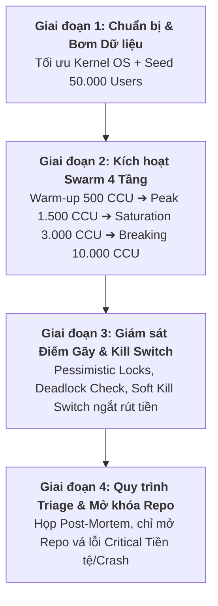

# KẾ HOẠCH TÁC CHIẾN "THỬ LỬA" (STRESS TEST & BREAKING POINT SOP)
**Dự án:** BanditBuddy GameFi Ecosystem  
**Phiên bản:** 2.0 (Đã hiệu chuẩn theo năng lực phần cứng vật lý máy chủ)  
**Chủ trì:** Nguyễn Mạnh Dũng (Tech Lead) & Đội ngũ DevOps / QA  
**Trạng thái Codebase:** CODE FREEZE (Đóng băng tuyệt đối, chỉ mở khi gặp lỗi Critical cấp 1)

---

## 🖥️ I. ĐÁNH GIÁ NĂNG LỰC PHẦN CỨNG MÁY CHỦ & HIỆU CHUẨN TẢI

### 1. Thông số Phần cứng & Giới hạn Vật lý Thực tế
Hạ tầng Staging/Production hiện tại đã được đo đạc và hệ thống hóa chi tiết:

| Thành phần | Thông số Vật lý Thực tế | Giới hạn Kỹ thuật Cốt lõi |
|---|---|---|
| **CPU** | **Intel(R) Xeon(R) CPU E5-1620 v2 @ 3.70GHz** | **4 Cores / 8 Threads** (Kiến trúc Ivy Bridge, 1 Socket). |
| **RAM** | **31 GiB (32 GB)** | Đang sử dụng: 8.7 GiB. Bộ nhớ khả dụng: ~22 GiB. Swap: 512 MB. |
| **Disk Storage** | **218 GB** (Phân vùng Root `/`) | Đã dùng: **155 GB (75%)**. Dung lượng còn trống: **53 GB**. |
| **OS File Descriptors** | `ulimit -n` = **1024** (Mặc định) | Tối đa 1024 sockets đồng thời cho mỗi tiến trình. |
| **TCP / Network Kernel** | `ip_local_port_range`: 32768 – 60999<br>`net.core.somaxconn`: 4096 | Tối đa **28.231 Ephemeral Outgoing Ports** trên 1 IP. Hàng đợi TCP SYN: 2048. |
| **Backend App** | NestJS trên Node.js 20 Alpine (Docker) | Single-threaded Event Loop (1 process). Bão hòa ở mức ~3.000 – 4.500 RPS. |
| **PostgreSQL 16** | `max_connections` = **100**, `shared_buffers` = **128MB** | Pool kết nối tối đa 100. TypeORM connection pool mặc định: 10. |
| **Redis 7** | Alpine In-Memory Cache | Phục vụ Rate Limiting & Session Token. |

---

### 2. Hiệu chuẩn: Tại sao phải điều chỉnh từ 1.000.000 CCU xuống Thang đo Khoa học?

* **Sự nhầm lẫn kỹ thuật giữa DAU và CCU:**
  * **1.000.000 Registered Users / DAU:** Là tổng số user đăng ký hoặc hoạt động rải rác trong 24 giờ. Quy mô này tương đương lưu lượng trung bình **~250 – 800 RPS** và đỉnh điểm khoảng **30.000 – 50.000 CCU**.
  * **1.000.000 CCU (Concurrent Users):** Là 1 triệu kết nối đồng thời trong **cùng 1 giây**. Nếu 1M CCU gửi request mỗi 5 giây, tải thực tế là **200.000 RPS**. Đây là quy mô của Steam, Riot Games hoặc Binance lúc sập giá, đòi hỏi cụm hàng trăm server Kubernetes phân tán.
* **Nguy cơ khi ép 1.000.000 CCU vào 1 máy chủ 4-core:**
  1. *Cháy Socket & Treo OS:* Vượt quá 28.231 cổng outgoing TCP, máy sinh tải (Locust) sẽ crash ngay với lỗi `EADDRNOTAVAIL` hoặc `EMFILE: too many open files`.
  2. *Tràn đĩa cứng (Disk Full):* Seed 1.000.000 user $\times$ 12 ô đất = 12 triệu dòng `farm_plots` kèm WAL logs sẽ ngốn sạch 53GB đĩa trống còn lại, làm sập toàn bộ database.
  3. *Không đo được Breaking Point thật:* Server sẽ chết ở tầng mạng Linux chứ không đo được logic nghiệp vụ của ứng dụng (Pessimistic locks, Soft Kill Switch, Anti-cheat).

---

### 3. Thang đo Chuẩn hóa cho Chiến dịch "Thử Lửa"

| Chỉ số | Quy mô Ban đầu của SA | Quy mô Hiệu chuẩn Thực tế | Mục tiêu Đạt được |
|---|---|---|---|
| **Dữ liệu Seeding (Users)** | 1.000.000 Users | **30.000 – 50.000 Users** | Đủ lớn để tạo áp lực Index Scan & tranh chấp farm mà không làm tràn 53GB đĩa cứng. |
| **Ví Web3 Seeding** | 1.000.000 Ví | **30.000 – 50.000 Ví** | Tạo lệnh Marketplace, Gacha và Claim EIP-712. |
| **Tải cao điểm (Normal Peak)** | 150.000 CCU | **1.500 – 2.000 CCU (~600 – 900 RPS)** | Mô phỏng chính xác giờ cao điểm của game đạt mốc 100.000 DAU. |
| **Ép tải Giới hạn (Breaking Point)** | 1.000.000 CCU | **5.000 – 10.000 CCU (~2.500 – 4.000 RPS)** | Đưa 100% CPU vào bão hòa, kiểm tra Throttler 429 và kích hoạt Soft Kill Switch. |

---

## 🚀 II. KẾ HOẠCH TÁC CHIẾN 4 GIAI ĐOẠN



---

### GIAI ĐOẠN 1: TỐI ƯU HẠ TẦNG & BƠM DỮ LIỆU (SEEDING)

#### 1. Cấu hình Tiên quyết cho Kernel & Kết nối Máy chủ
Trước khi chạy test, DevOps bắt buộc phải nới rộng giới hạn hệ điều hành để tránh nghẽn cổ chai ở tầng mạng:
```bash
# 1. Tăng File Descriptors (tránh lỗi EMFILE)
ulimit -n 65535
sudo sysctl -w fs.file-max=2097152

# 2. Mở rộng hàng đợi kết nối TCP và dải cổng mạng
sudo sysctl -w net.core.somaxconn=65535
sudo sysctl -w net.ipv4.tcp_max_syn_backlog=8192
sudo sysctl -w net.ipv4.ip_local_port_range="1024 65535"
sudo sysctl -w net.ipv4.tcp_tw_reuse=1
```

#### 2. Cấu hình Database & Connection Pool
* **PostgreSQL:** Tăng `max_connections` trong PostgreSQL container lên **200**.
* **TypeORM Pool:** Trong `backend/src/database/database.module.ts`, thêm `extra: { max: 30, min: 5 }` để phục vụ tải đa luồng.

#### 3. Bơm Dữ liệu Giả lập (Data Seeding)
* **Users:** Bơm **50.000 tài khoản** vào bảng `users` với đầy đủ trạng thái cấp độ (Cấp 1 – 15).
* **Farms:** Mỗi user khởi tạo mặc định 6 ô đất (Tổng ~300.000 ô đất trong bảng `farm_plots`), trong đó 30% ô đất ở trạng thái chín (ripe) để kích hoạt kịch bản ăn trộm.
* **Web3 Wallets:** Sinh ngẫu nhiên 50.000 địa chỉ ví BSC kèm private key giả lập lưu trong bộ nhớ runner.
* **Kho bạc Testnet:** Bơm 5.000.000 FARM và 50 BNB Testnet vào ví Treasury để phục vụ kịch bản rút tiền và nạp rút.

---

### GIAI ĐOẠN 2: KÍCH HOẠT ĐẠO QUÂN BOT (SWARM EXECUTION)

#### 1. Kiến trúc Runner Phân tán (Locust / K6 Distributed)
* **QUY TẮC BẮT BUỘC:** **KHÔNG chạy Locust trực tiếp trên máy chủ chứa Backend/DB**.
  * Bản thân tiến trình sinh tải 5.000 – 10.000 user sẽ ngốn từ 2 – 4 CPU Cores. Nếu chạy trên cùng máy, bot test sẽ tranh chấp CPU của chính Backend, làm sai lệch toàn bộ kết quả đo lường.
  * Triển khai runner từ 1 hoặc 2 máy chủ Worker bên ngoài bắn traffic vào cổng `3003` hoặc domain Staging.

#### 2. Phân bổ Lực lượng Persona (Dựa trên 50.000 Users)
* **80% F2P Grinders (40.000 Bot):**
  * Tần suất gọi: Liên tục gọi `/action/plant`, `/action/harvest`, `/action/water`, `/action/steal`.
  * Rút tiền: Đổ xô gọi API `/web3/claim-signature` để rút token từ GOLD sang FARM.
* **15% Web3 Farmers (7.500 Bot):**
  * Tần suất gọi: Đăng bán vật phẩm lên Chợ `/marketplace/list`, mua hàng qua `/marketplace/buy`, và đúc Chó Web2 thành NFT Chó Vệ Sĩ.
* **5% Whale Degens (2.500 Bot):**
  * Tần suất gọi: Quay Gacha liên tục `/action/gacha`, gọi hợp đồng `BanditDogFusion.sol`, kích hoạt lệnh mua lại tự động `/web3/treasury-trigger`.

#### 3. Kịch bản Ép tải Phân tầng (Tiered Ramp-Up)

| Mốc thời gian | Tải CCU | Tốc độ Spawn | RPS Ước tính | Trọng tâm Giám sát |
|---|---|---|---|---|
| **Phút 0 – 5** | **500 CCU** | 20 users/s | ~150 – 250 RPS | **Warm-up Baseline:** Đo độ trễ nền p95 (< 80ms). Xác nhận toàn bộ Auth JWT/Session Token thông suốt. |
| **Phút 5 – 15** | **1.500 CCU** | 50 users/s | ~600 – 900 RPS | **Giờ Cao Điểm Thật (Peak Load):** Mô phỏng 100k DAU. CPU kỳ vọng 50 – 65%. Zero lỗi 500. |
| **Phút 15 – 25** | **3.000 CCU** | 100 users/s | ~1.200 – 1.800 RPS | **Bão Hòa Tranh Chấp (Saturation):** Hàng ngàn bot ăn trộm cùng 1 nông trại. Kiểm tra `SELECT ... FOR UPDATE` và hàng đợi lock của DB. |
| **Phút 25 – 40** | **5.000 ➔ 10.000 CCU** | 250 users/s | ~2.500 – 4.000 RPS | **ĐIỂM GÃY (Breaking Point):** Đưa CPU lên 100%. Bắt buộc Throttler trả về 429 và Soft Kill Switch ngắt rút tiền. |

---

### GIAI ĐOẠN 3: GIÁM SÁT ĐIỂM GÃY (BREAKING POINT) & CHỐT CHẶN BẢO VỆ

Đây là giai đoạn quyết định tính sống còn của mô hình kinh tế Web2.5. Toàn bộ đội ngũ mở Dashboard Grafana, PgHero, và nhóm Telegram Alert.

#### 1. Kiểm tra Tính Toàn vẹn Dữ liệu (Concurrency Integrity)
* **Chống Deadlock:** Theo dõi lệnh `SELECT * FROM pg_stat_activity WHERE wait_event_type = 'Lock'`.
  * Khi 500 bot cùng lúc ăn trộm một người chơi hoặc nâng cấp ô đất: Cơ chế `pessimistic_write` phải xếp hàng tuần tự.
  * **Kỳ vọng:** Không phát sinh bất kỳ lỗi `deadlock detected (40P01)`. Request vào sau phải chờ hoặc nhận thông báo lỗi hợp lệ ("Already watered", "Protected farm").
* **Không nhân bản tài sản (Zero Double-Spend):** Sau đợt test, quét Database kiểm tra:
  * Không có user nào số dư vàng bị âm (`gold_balance < 0`).
  * Không có ô đất nào vượt quá cấp 5 hoặc vượt quá 12 ô đất/user.
  * Số lượng token rút trên on-chain khớp 100% với số vàng đã bị trừ trong Database.

#### 2. Kiểm tra Throttler & Giới hạn Tần suất (Anti-Spam)
* Khi bot spam vượt quá 3 req/giây trên endpoint `/action/steal`:
  * Hệ thống NestJS bắt buộc phải phản hồi mã **HTTP 429 (Too Many Requests)**.
  * Quá trình harvest tay liên tục trên nhiều ô đất không bị dính 429 nhờ `@SkipThrottle()`.

#### 3. Kích hoạt Chốt chặn Khẩn cấp (Soft Kill Switch)
* **Kịch bản:** 40.000 bot F2P ồ ạt rút tiền cho đến khi số dư Quỹ Treasury ảo tụt giảm quá 30% trong 1 giờ, hoặc khi CPU máy chủ chạm ngưỡng 95% kéo dài hơn 3 phút.
* **Kỳ vọng Thực tế:**
  1. `DexOracleService` / `TreasuryMonitorService` tự động bật cờ: `is_kill_switch_active = true`.
  2. Toàn bộ lệnh rút tiền tiếp theo `/web3/claim-signature` lập tức bị chặn lại với mã **HTTP 503** kèm thông báo bảo vệ:
     > *"Network synchronization delay. The withdrawal vault is undergoing automated liquidity balancing. Please try again later."*
  3. Tất cả các ví tiếp tục spam gọi API rút tiền trong thời gian Kill Switch kích hoạt sẽ tự động bị đánh dấu ghi vào bảng `admin_watchlist` (Honeypot chống bot).

---

### GIAI ĐOẠN 4: QUY TRÌNH HỌP POST-MORTEM & XỬ LÝ SỰ CỐ (TRIAGE PROTOCOL)

Sau khi hoàn tất kịch bản ép tải, Tech Lead Nguyễn Mạnh Dũng sẽ chủ trì phiên họp Triage. Toàn bộ lỗi ghi nhận được phân loại theo bộ lọc bất di bất dịch:

```
                  ┌─────────────────────────────────────┐
                  │          PHÁT HIỆN LỖI TEST         │
                  └──────────────────┬──────────────────┘
                                     │
                 ┌───────────────────┴───────────────────┐
                 ▼                                       ▼
       [NHÓM 1: CRITICAL]                      [NHÓM 2: NON-CRITICAL]
   - Double-spend vàng/FARM                - Lệch CSS / Animation lag
   - Bypass lock, duplicate item           - Delay nhẹ WebSocket notice
   - Reentrancy / EIP-712 replay           - 429 timeout phía client
   - Crash OOM Node.js sập hẳn             - Lỗi hiển thị avatar
                 │                                       │
                 ▼                                       ▼
      ┌─────────────────────┐                 ┌─────────────────────┐
      │  MỞ KHÓA REPO GIT   │                 │   GIỮ NGUYÊN FREEZE │
      │  Hotfix + Test lại  │                 │ Đưa vào Backlog v2  │
      └─────────────────────┘                 └─────────────────────┘
```

#### Quy trình Mở khóa & Đóng băng Repo (Hotfix Routine):
1. **Chỉ mở khóa khi có lỗi Nhóm 1 (Critical):** Tuyệt đối không mở khóa repo vì các lỗi giao diện hoặc tối ưu nhỏ.
2. **Nhánh Hotfix:** Tạo nhánh riêng `hotfix/issue-description` từ nhánh `main`.
3. **Viết Test Chứng minh:** Bắt buộc viết thêm Unit Test / Integration Test chứng minh đã dập tắt hoàn toàn lỗi race-condition hoặc lỗ hổng tiền tệ.
4. **Merge & Tái Đóng Băng:** Merge vào `main`, deploy lại lên Staging, chạy lại kịch bản Stress Test ở Phase đó để xác nhận không bị tái phát, sau đó lập tức **Đóng băng Code (Code Freeze)** trở lại.

---

## 📋 III. CHECKLIST TRƯỚC GIỜ BẤM NÚT

- [ ] Đã chạy lệnh tăng `ulimit -n 65535` và mở rộng `somaxconn` trên server Staging.
- [ ] Đã kiểm tra kết nối `GET /api/ping` trả về `{"ok":true}`.
- [ ] Đã chuẩn bị runner Locust / K6 ở máy chủ độc lập bên ngoài.
- [ ] Đã backup bản Snapshot Database trước khi bơm 50.000 user test.
- [ ] Đã kích hoạt Telegram Alert Bot nhận cảnh báo lỗi từ server.
- [ ] Nhánh GitHub đã khóa quyền Push trực tiếp, sẵn sàng đón nhận chiến dịch "Thử Lửa".
