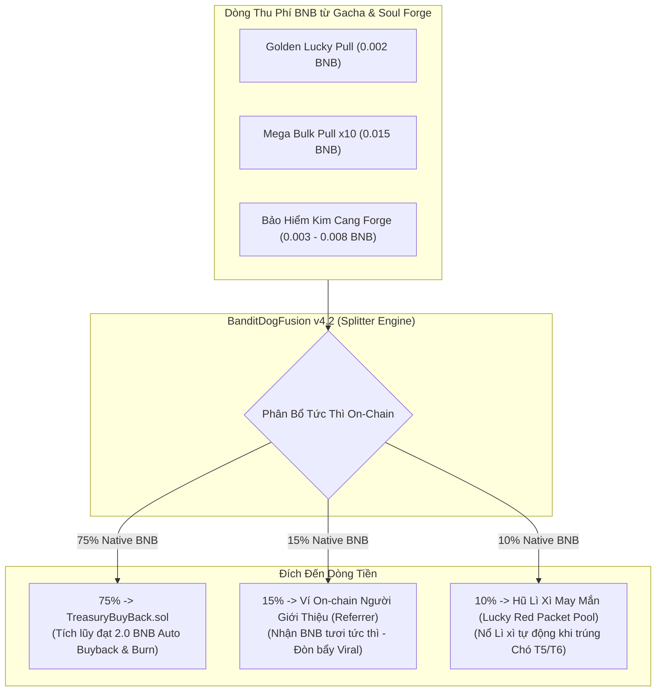
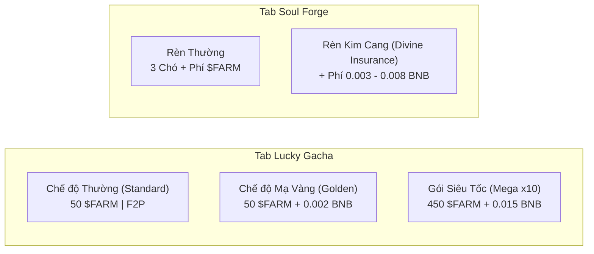
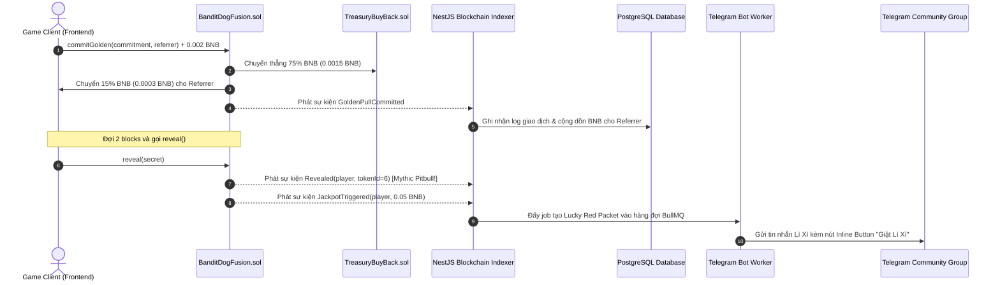
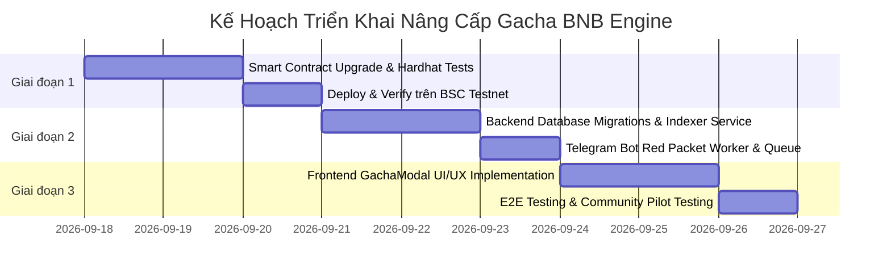

# KIẾN TRÚC HỆ THỐNG: ĐỘNG CƠ THU PHÍ BNB & CƠ CHẾ VIRAL CHO GACHA MODAL
**Tài liệu Đề xuất Kiến trúc Kỹ thuật (Software Architecture Proposal)**
*Dự án: Bandit Buddy (Telegram Web3 Mini App on BSC)*  
*Tác giả: Lead System Architect & Tokenomics Specialist*  
*Trạng thái: Chờ Phê duyệt (Pending Architecture Review & Feedback)*

---

## 1. TỔNG QUAN & BỐI CẢNH DỰ ÁN (EXECUTIVE SUMMARY)

### 1.1. Bối cảnh & Mục tiêu
- **Hạ tầng hiện tại:** Hợp đồng [`TreasuryBuyBack.sol`](contracts/src/TreasuryBuyBack.sol) đã vận hành hoàn chỉnh với ngưỡng kích hoạt **2.0 BNB**. Khi số dư Vault đạt $\ge 2.0\text{ BNB}$, cơ chế tự động thực hiện hoán đổi BNB lấy token `$FARM` trên PancakeSwap V2 và chuyển thẳng về ví vĩnh viễn [`0x000...dEaD`](https://testnet.bscscan.com/address/0x000000000000000000000000000000000000dEaD) để tạo nến xanh và triệt tiêu lạm phát.
- **Vấn đề cốt lõi:** Các giao dịch DEX hiện chỉ thu thuế bằng token `$FARM`, không tạo ra BNB cho Vault. Mặc dù hệ thống đã bổ sung 3 luồng thu BNB (Tokenize Dog, BarnServices, Marketplace), nhưng **Gacha Modal** (nơi tập trung lưu lượng tương tác cao nhất của game thủ) hiện **chỉ thu và đốt $FARM**, bỏ phí một "mỏ vàng" tạo dòng tiền Real Yield bằng BNB.
- **Mục tiêu đề xuất:** Thiết kế lại Gacha Modal thành một **Động cơ Thu thuế BNB (BNB Revenue Engine)** kết hợp **Vòng lặp Lan truyền (Viral Loop)**, đảm bảo:
  1. **Không tạo rào cản cho người chơi cày chay (F2P Friendly):** Duy trì luồng quay truyền thống bằng $FARM.
  2. **Kích thích người chơi trả phí BNB tự nguyện:** Đánh vào lòng tham (tỷ lệ rơi đồ hiếm x2), nỗi sợ mất mát (Bảo hiểm rèn chó), và sự tiện lợi (Quay x10 cho Whales).
  3. **Viral hữu cơ trên Telegram:** Cơ chế trả thưởng hoa hồng BNB tức thì về ví người giới thiệu và nổ Lì Xì BNB cộng đồng khi có giải thưởng lớn.

---

## 2. MA TRẬN PHÂN BỔ DOANH THU BNB (REVENUE ALLOCATION MATRIX)

Toàn bộ dòng tiền BNB thu được từ Gacha Modal được Smart Contract phân bổ tự động, minh bạch và tức thì theo tỷ lệ **75% - 15% - 10%**:



| Tỷ lệ | Đích đến | Ý nghĩa & Tác động Kinh tế |
| :---: | :--- | :--- |
| **75%** | **Treasury Vault (`TreasuryBuyBack.sol`)** | Nạp thẳng vào bể quỹ để nhanh chóng đạt mốc **2.0 BNB**, tự động gom $FARM trên PancakeSwap và đốt. |
| **15%** | **Ví On-chain của Referrer (Người mời)** | Bắn thẳng BNB vào ví Web3 của người giới thiệu theo thời gian thực. Tạo động lực cho KOLs, Admin nhóm Telegram chia sẻ link game. |
| **10%** | **Hũ Lì Xì May Mắn (Community Red Packet)** | Tích lũy quỹ thưởng cộng đồng. Khi có người nổ chó thần thoại, hũ mở ra cho toàn bộ chat group Telegram giật lì xì. |

---

## 3. ĐẶC TẢ CHI TIẾT CÁC TÍNH NĂNG MỚI TRONG GACHA MODAL



### 3.1. Tính năng 1: Chế độ "Golden Lucky Pull" (Quay May Mắn Mạ Vàng)
* **Ý tưởng:** Người chơi có quyền chọn giữa quay thường (chỉ tốn $FARM) hoặc nâng cấp lên quay mạ vàng.
* **Chi phí:** `50 $FARM` + **`0.002 BNB`** (~$1.1 USD).
* **Đặc quyền:**
  - **Tăng gấp đôi (+100%)** tỷ lệ rơi các giống chó cấp cao:
    - *Husky (Tier 3 - Rare):* $10\% \longrightarrow \mathbf{16\%}$
    - *Rottweiler (Tier 4 - Epic):* $4\% \longrightarrow \mathbf{8\%}$
    - *Doberman (Tier 5 - Legendary):* $1.5\% \longrightarrow \mathbf{3.5\%}$
    - *Pitbull (Tier 6 - Mythic):* $0.5\% \longrightarrow \mathbf{1.5\%}$
  - Tặng thêm **3 Mảnh Linh Hồn (Soul Shards)** an ủi ngay cả khi quay ra Chó Cỏ Tier 1.
  - Tích lũy **+2 Điểm Pity** (thay vì +1 điểm ở chế độ thường).

### 3.2. Tính năng 2: Gói Quay Siêu Cấp x10 (Mega Bulk Pull x10)
* **Ý tưởng:** Dành riêng cho đối tượng Whales và người chơi muốn săn chó cấp cao nhanh chóng, không muốn ngồi bấm từng lượt và chờ từng block xác nhận.
* **Chi phí:** `450 $FARM` *(Giảm giá 10% FARM)* + **`0.015 BNB`** *(Ưu đãi 25% so với quay lẻ 10 lần)*.
* **Đặc quyền:**
  - **Đảm bảo chắc chắn (Guaranteed Drop):** Ít nhất **1 Chó Rare Tier 3 (Husky)** trở lên trong lượt 10 thẻ.
  - **Tiết kiệm Gas:** Gộp 10 lượt commit-reveal vào 1 transaction duy nhất, tiết kiệm đến 80% gas mạng BSC.
  - **Hiệu ứng Animation:** Mở hòm kho báu ánh kim 10 thẻ đồng thời, kích thích chia sẻ ảnh chụp màn hình lên mạng xã hội.

### 3.3. Tính năng 3: Bảo Hiểm Kim Cang trong Lò Rèn (Divine Insurance for Soul Forge)
* **Ý tưởng:** Đánh vào tâm lý sợ mất mát (Loss Aversion) khi người chơi dung hợp chó cấp cao (Tier 2 $\rightarrow$ Tier 3 hoặc Tier 3 $\rightarrow$ Tier 4).
* **Chi phí kích hoạt:**
  - *Tier 1 $\rightarrow$ Tier 2 (Chihuahua lên Corgi):* **`0.002 BNB`**
  - *Tier 2 $\rightarrow$ Tier 3 (Corgi lên Husky):* **`0.004 BNB`**
  - *Tier 3 $\rightarrow$ Tier 4 (Husky lên Rottweiler):* **`0.008 BNB`**
* **Cơ chế bồi thường khi thất bại (Fail Protection):**
  - Giữ nguyên vẹn **100% cả 3 con chó nguyên liệu** (không bị đốt con nào).
  - Đền bù ngay **30 Soul Shards** (giúp nhanh chóng đổi chó bảo hiểm 100 shards).
  - **Hoàn trả 50% số $FARM** chi phí dung hợp đã nộp.

### 3.4. Tính năng 4: Vòng lặp Lan truyền (Telegram Viral Engine)
1. **Chia sẻ Lì Xì May Mắn (Lucky Red Packet):**
   - 10% phí BNB được gom vào `redPacketPool`.
   - Mỗi khi người chơi mở ra Chó Tier 5 (Legendary) hoặc Tier 6 (Mythic), hợp đồng phát sự kiện `JackpotTriggered`.
   - Worker Telegram tự động phát sinh một gói Lì Xì (ví dụ: chia làm 20 phần ngẫu nhiên) và gửi tin nhắn đính kèm Inline Button vào Group Chat:
     > *"👑 Game thủ @inotgame vừa đúc thành công PITBULL THẦN THOẠI! Mời cả làng vào giật hũ Lì Xì 0.05 BNB may mắn!"*
   - Người trong nhóm bấm nút sẽ mở Mini App để nhận thưởng BNB $\rightarrow$ Kéo người chơi cũ và mới vào game liên tục.
2. **Thanh FOMO Tiến Độ Buyback Live:**
   - Đặt thanh tiến độ ngay đầu Gacha Modal:
     $$\mathbf{Vault\text{ Accumulation: } 1.450\text{ / }2.000\text{ BNB (72.5\%)}}$$
   - Hiển thị ước tính: *"Cần thêm ~37 lượt Golden Pull để kích hoạt quét nến xanh đốt $FARM!"*

---

## 4. THIẾT KẾ KIẾN TRÚC KỸ THUẬT (TECHNICAL SPECIFICATIONS)

### 4.1. Kiến Trúc Smart Contract (`BanditDogFusion.sol v4.2`)

```solidity
// SPDX-License-Identifier: MIT
pragma solidity ^0.8.24;

interface ITreasuryBuyBack {
    function receiveBnbRevenue() external payable;
}

contract BanditDogFusionV42 is ReentrancyGuard, Ownable, Pausable {
    // ─── Constants & State Variables ──────────────────────────────────────────
    uint256 public constant REVENUE_VAULT_BPS    = 7500; // 75%
    uint256 public constant REVENUE_REF_BPS      = 1500; // 15%
    uint256 public constant REVENUE_JACKPOT_BPS  = 1000; // 10%
    uint256 public constant BPS_DENOMINATOR      = 10000;

    uint256 public goldenPullBnbFee = 0.002 ether;
    uint256 public bulk10PullBnbFee = 0.015 ether;
    uint256 public bulk10FarmCost   = 450 * 1e18; // 10% discount on FARM

    mapping(uint256 => uint256) public forgeInsuranceFees; // tierId => BNB fee
    uint256 public jackpotPoolBnb;

    address public treasuryBuyBackAddress;
    address public backendSigner;

    // ─── Events ───────────────────────────────────────────────────────────────
    event GoldenPullCommitted(address indexed player, bytes32 commitment, address indexed referrer);
    event Bulk10PullExecuted(address indexed player, uint256[] tokenIds, uint256 bnbFeePaid);
    event DivineInsuranceClaimed(address indexed player, uint256 requestId, uint256 shardsCompensated);
    event JackpotPoolFunded(uint256 amountAdded, uint256 totalJackpot);
    event JackpotTriggered(address indexed winner, uint256 indexed tokenId, uint256 jackpotAmount);

    // ─── Internal BNB Revenue Routing ─────────────────────────────────────────
    function _routeBnbRevenue(uint256 totalBnb, address referrer) internal {
        if (totalBnb == 0) return;

        uint256 vaultShare = (totalBnb * REVENUE_VAULT_BPS) / BPS_DENOMINATOR;
        uint256 refShare   = (totalBnb * REVENUE_REF_BPS) / BPS_DENOMINATOR;
        uint256 jackpotShare = totalBnb - vaultShare - refShare;

        // 1. Route 75% directly to Treasury BuyBack Vault
        if (treasuryBuyBackAddress != address(0) && vaultShare > 0) {
            (bool okVault, ) = treasuryBuyBackAddress.call{value: vaultShare}("");
            require(okVault, "BNB transfer to Vault failed");
        }

        // 2. Route 15% to Referrer (Fallback to Vault if no valid referrer)
        if (referrer != address(0) && referrer != msg.sender && refShare > 0) {
            (bool okRef, ) = referrer.call{value: refShare}("");
            if (!okRef) {
                // If referrer transfer reverts, safely forward to Vault
                (bool okFallback, ) = treasuryBuyBackAddress.call{value: refShare}("");
                require(okFallback, "Fallback to Vault failed");
            }
        } else {
            (bool okVault, ) = treasuryBuyBackAddress.call{value: refShare}("");
            require(okVault, "Fallback ref share to Vault failed");
        }

        // 3. Keep 10% for Community Jackpot / Red Packet
        jackpotPoolBnb += jackpotShare;
        emit JackpotPoolFunded(jackpotShare, jackpotPoolBnb);
    }

    // ─── Golden Lucky Pull ────────────────────────────────────────────────────
    function commitGolden(bytes32 commitment, address referrer) external payable nonReentrant whenNotPaused {
        require(msg.value >= goldenPullBnbFee, "Insufficient BNB fee for Golden Pull");

        // 1. Burn 50 FARM
        farmToken.safeTransferFrom(msg.sender, address(this), pullCost);
        _burn(pullCost);

        // 2. Record pending commit with Golden status
        pendingPulls[msg.sender] = PendingPull({
            commitment: commitment,
            commitBlock: block.number,
            revealed: false,
            isGolden: true
        });

        // 3. Route BNB Fee
        _routeBnbRevenue(msg.value, referrer);

        emit GoldenPullCommitted(msg.sender, commitment, referrer);
    }
}
```

---

### 4.2. Kiến Trúc Backend Indexer & Telegram Worker



#### Cập nhật Database Schema (PostgreSQL):
```sql
-- Bảng lưu trữ gói Lì xì may mắn cộng đồng
CREATE TABLE IF NOT EXISTS public.community_red_packets (
    id UUID PRIMARY KEY DEFAULT gen_random_uuid(),
    trigger_user_id UUID NOT NULL REFERENCES public.users(id),
    dog_tier_id INTEGER NOT NULL,
    total_bnb_amount NUMERIC(18, 8) NOT NULL,
    remaining_bnb_amount NUMERIC(18, 8) NOT NULL,
    total_claims INTEGER NOT NULL DEFAULT 20,
    remaining_claims INTEGER NOT NULL DEFAULT 20,
    status VARCHAR(20) NOT NULL DEFAULT 'active', -- 'active' | 'exhausted' | 'expired'
    created_at TIMESTAMP WITHOUT TIME ZONE DEFAULT NOW(),
    expires_at TIMESTAMP WITHOUT TIME ZONE DEFAULT NOW() + INTERVAL '24 hours'
);

-- Bảng lưu chi tiết người nhận lì xì
CREATE TABLE IF NOT EXISTS public.red_packet_claims (
    id UUID PRIMARY KEY DEFAULT gen_random_uuid(),
    packet_id UUID NOT NULL REFERENCES public.community_red_packets(id) ON DELETE CASCADE,
    user_id UUID NOT NULL REFERENCES public.users(id),
    claimed_bnb NUMERIC(18, 8) NOT NULL,
    tx_hash VARCHAR(66),
    claimed_at TIMESTAMP WITHOUT TIME ZONE DEFAULT NOW(),
    CONSTRAINT uq_packet_user UNIQUE (packet_id, user_id)
);

-- Bổ sung trường ghi nhận hoa hồng BNB cho bảng users
ALTER TABLE public.users 
ADD COLUMN IF NOT EXISTS total_bnb_referral_earned NUMERIC(18, 8) DEFAULT 0;
```

---

### 4.3. Thiết Kế Giao Diện UI/UX (Frontend Specifications)

1. **Tab "Lucky Gacha" – Bộ Chọn Chế Độ (Mode Switcher):**
   - Đặt một Toggle Switch rõ nét ở đầu màn hình:
     - `[ Chế độ Thường (50 FARM) ]` $\longleftrightarrow$ `[ ✨ Mạ Vàng (+0.002 BNB) ]`
   - Khi bật **Mạ Vàng**, toàn bộ viền vòng quay đổi sang hiệu ứng vàng kim (Gold Glow), tỷ lệ hiển thị trên bảng Dog Tiers tự động cập nhật x2 giá trị với badge nhấp nháy `2X CHANCE`.
2. **Nút Quay Siêu Tốc x10 (Mega 10x Pull):**
   - Đặt cạnh nút quay đơn, màu tím huyền bí pha vàng kim:
     `[ 💎 MỞ 10 LƯỢT (450 FARM + 0.015 BNB) ]`
   - Kèm nhãn nổi bật: *"Bảo đảm 100% nhận ít nhất 1 Chó Rare T3 trở lên"*.
3. **Tab "Soul Forge" – Tùy chọn Bảo Hiểm Kim Cang:**
   - Thêm checkbox toggle ngay dưới nút "Fuse":
     `[✓] Kích hoạt Bảo Hiểm Kim Cang (Phí: 0.003 BNB)`
   - Tooltip giải thích: *"Nếu xịt: Giữ lại 100% 3 con chó + Hoàn 50% FARM + Tặng 30 Soul Shards"*.
4. **Thanh Tiến Độ Buyback Vault (Vault FOMO Bar):**
   - Thanh tiến độ động gắn ngay dưới banner Gacha, cập nhật realtime mỗi 20s qua WebSocket / API polling:
     `Vault: 1.45 / 2.00 BNB · Còn 0.55 BNB nữa là Auto Buyback & Burn $FARM!`

---

## 5. DỰ PHÓNG KINH TẾ & TỐC ĐỘ GOM 2.0 BNB (PROJECTION MODEL)

Giả định quy mô cộng đồng Telegram Mini App có **2,000 người chơi hoạt động hàng ngày (DAU)**:

| Hoạt động | Lượng giao dịch / Ngày | Phí BNB / Lượt | Tổng BNB Thu Được | 75% Vào Vault Buyback |
| :--- | :---: | :---: | :---: | :---: |
| **Golden Lucky Pull** | 400 lượt/ngày | 0.002 BNB | 0.80 BNB | **0.60 BNB** |
| **Mega Bulk Pull x10** | 80 lượt/ngày | 0.015 BNB | 1.20 BNB | **0.90 BNB** |
| **Bảo Hiểm Soul Forge** | 150 lượt/ngày | 0.004 BNB (TB) | 0.60 BNB | **0.45 BNB** |
| **Đúc Chó Cỏ (Tokenize Bridge)** | 100 lượt/ngày | 0.002 BNB | 0.20 BNB | **0.15 BNB** |
| **TỔNG CỘNG HÀNG NGÀY** | — | — | **2.80 BNB / ngày** | **2.10 BNB / ngày** |

> [!TIP]
> **Kết luận phân tích kinh tế:** 
> Với mô hình này, hệ thống sẽ gom được trung bình **$\sim 2.10\text{ BNB/ngày}$ nạp thẳng vào Vault**. Điều này đồng nghĩa cơ chế **Auto Buyback & Burn $FARM sẽ đều đặn kích hoạt mỗi 24 giờ một lần**, liên tục tạo lực mua thị trường (Market Buying Pressure) đẩy giá token $FARM trên PancakeSwap!

---

## 6. PHÂN TÍCH RỦI RO & GIẢI PHÁP AN NINH (SECURITY & RISK MITIGATION)

1. **Rủi ro Reentrancy khi gọi `.call{value: share}("")`:**
   - *Nguy cơ:* Chuyển native BNB cho ví người giới thiệu có thể bị tấn công tái nhập nếu người giới thiệu là một smart contract độc hại.
   - *Giải pháp:*
     - Toàn bộ hàm chứa lệnh chuyển BNB phải gắn modifier `nonReentrant` của OpenZeppelin.
     - Áp dụng nguyên tắc **Checks-Effects-Interactions**: Cập nhật toàn bộ biến trạng thái (state variables) trước khi thực hiện chuyển tiền.
     - Giới hạn gas khi gửi tiền cho ví Referrer (hoặc gom vào hàm `claimReferralBnb()` theo mô hình Pull Payment thay vì Push Payment).
2. **Rủi ro Nghẽn / Khai thác RNG (Front-running Commit-Reveal):**
   - *Nguy cơ:* Người chơi giải mã blockhash trước để hủy giao dịch nếu không ra chó xịn.
   - *Giải pháp:* Giữ nguyên vẹn kiến trúc Commit-Reveal 2 bước với độ trễ `MIN_REVEAL_BLOCKS = 2` và Backend Oracle chữ ký để loại bỏ hoàn toàn khả năng can thiệp RNG từ phía client.
3. **Rủi ro Tự Giới Thiệu (Self-Referral Exploitation):**
   - *Nguy cơ:* Người chơi tạo ví phụ làm ref để tự nhận lại 15% phí BNB.
   - *Giải pháp:* Smart contract kiểm tra `require(referrer != msg.sender, "Cannot refer self")`. Dù người chơi cố tình dùng ví khác, 85% chi phí còn lại vẫn được chuyển về Vault và Jackpot, mang lại lợi ích ròng cho hệ sinh thái.

---

## 7. KẾ HOẠCH TRIỂN KHAI THEO GIAI ĐOẠN (IMPLEMENTATION ROADMAP)



---

## 8. CÂU HỎI LẤY Ý KIẾN (QUESTIONS FOR ARCHITECTURE REVIEW)

Kính đề nghị Architecture Reviewer cho ý kiến phản hồi về các điểm sau:
1. **Mô hình Trả thưởng Referral:** Nên bắn trực tiếp BNB về ví Referrer ngay lập tức (**Push Payment** - tiện lợi nhưng tốn thêm gas cho user), hay lưu số dư trên hợp đồng để Referrer tự bấm nút rút tiền (**Pull Payment** - an toàn tuyệt đối và tiết kiệm gas)?
2. **Mức phí Golden Pull (`0.002 BNB`):** Mức phí này tương đương $\approx \$1.1\text{ USD}$ ở thời điểm hiện tại. Mức này đã đủ hấp dẫn cho đại đa số người chơi hay nên giảm xuống `0.001 BNB` để tăng volume ban đầu?
3. **Bảo hiểm Soul Forge:** Có nên mở rộng Bảo hiểm Kim Cang cho cả đợt nâng cấp Tier 4 $\rightarrow$ Tier 5 (Rottweiler lên Doberman) với mức phí `0.015 BNB` không?

---
*Báo cáo được lưu trữ tại:*
- Artifact Path: `file:///home/ubuntu/.gemini/antigravity-cli/brain/05ecd0ae-a392-4e25-8d5d-146cd4a882e7/gacha_bnb_fee_architecture_proposal.md`
- Repository Path: [`/home/ubuntu/barnbuddy/GACHA_BNB_FEE_ARCHITECTURE_PROPOSAL.MD`](GACHA_BNB_FEE_ARCHITECTURE_PROPOSAL.MD)
