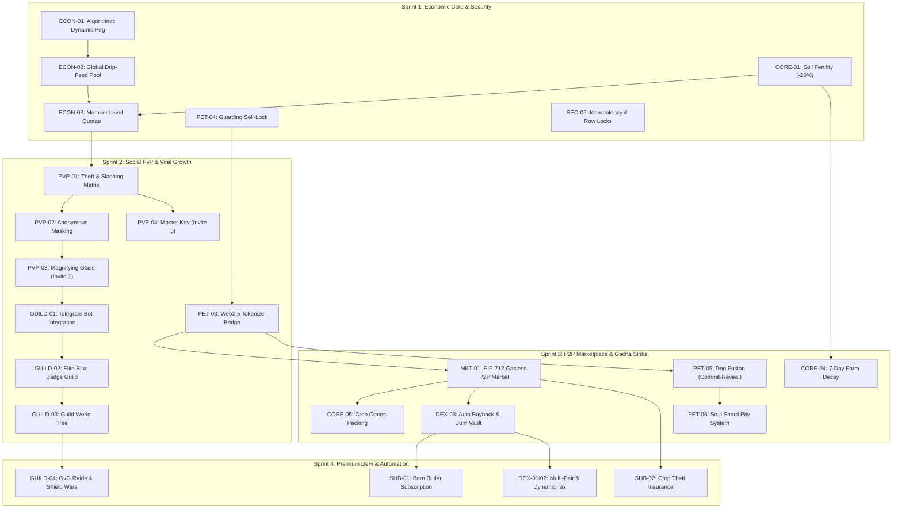

# BANDIT BUDDY WEB3 — MASTER PRD FEATURE CATALOG & PRIORITIZATION
**Document Version:** 2.0 (Post-Audit Synthesis)  
**Target Platform:** Telegram Mini App (TMA) / BNB Smart Chain (BSC Testnet & Mainnet)  
**Source Baseline:** Extracted from `/home/ubuntu/barnbuddy/Chọn Game Open Source Làm Web3 v2.docx` (Complete Architectural Analysis)  
**Target Audience:** Product Owner, Lead Software Architect, Smart Contract Engineers, Backend/Frontend Leads  

---

## 1. Executive Summary & Product Vision

### 1.1 Product Identity
**Bandit Buddy** is a Web3 social farming and PvP theft simulator built natively for **Telegram Mini Apps (TMA)** and deployed on the **BNB Smart Chain (BSC)**. Revitalizing the viral classic mechanics of *Barn Buddy* (Facebook era) and modernizing them with *Pixels*-style Web2.5 tokenomics, Bandit Buddy eliminates user friction through instant guest play while introducing hard-hitting financial mechanics: deflationary token sinks, algorithmic dynamic pegging, P2P gasless escrow trading, and high-stakes social PvP.

### 1.2 Core Architectural Principles (Web2.5 Hybrid Model)
1. **Server-Authoritative Core:** All gameplay state transitions (planting, growing, harvesting, theft attempts, weather disasters, fertility decay) are calculated strictly on the NestJS backend. Zero financial or reward logic is trusted on the client.
2. **Single-Token + Soft Currency Economic Model:**
   - **GOLD (Off-chain Soft Currency):** In-game operational currency with dynamic faucets (harvests, daily quests) and aggressive operational expense sinks (seeds, tool repair, fertilizer, dog food, farm maintenance).
   - **$FARM (On-chain BEP-20 Token, Fixed Supply 1,000,000,000):** The primary asset for land expansion, breeding/fusion, NFT tokenization, marketplace fees, subscriptions, and governance.
3. **Dual-Layer Anti-Inflation Protection:**
   - **Algorithmic Dynamic Peg (vAMM):** Live conversion rates between GOLD and $FARM anchored to USD and tempered by the in-game Burn/Mint velocity ($\alpha$) and DEX oracle prices.
   - **Dynamic Daily Cashout Quotas (Global Drip-Feed):** Server-wide withdrawal caps scaled to 24h market liquidity and player Trust Tiers (Member Levels), completely preventing bank-run liquidity drains.
4. **Viral Social-Fi Flywheels:**
   - Deep Telegram integration: Guilds operating inside Telegram group chats via the Bandit Buddy Bot.
   - Psychological PvP: Anonymous theft masked by default, fueling referral loops through consumable items (*Magnifying Glass* to reveal thieves, *Master Key* to bypass guard dogs).

---

## 2. Master Feature Catalog (Grouped by Module)

```
┌─────────────────────────────────────────────────────────────────────────────────────────┐
│                                BANDIT BUDDY FEATURE TREE                                │
├──────────────────────────┬──────────────────────────┬───────────────────────────────────┤
│ 1. Core Farming & Land   │ 2. Guard Dogs & Fusion   │ 3. Social PvP & Viral Loops       │
│  - 6 to 12 Plots Leveling│  - 5-Tier Dog Roster     │  - Anonymous Steal (20% Cap)      │
│  - Soil Fertility Decay  │  - Slashing Bite Formula │  - Magnifying Glass (Invite 1)    │
│  - 4h Weather OpEx Sinks │  - Web2.5 Tokenize Bridge│  - Master Key (Invite 3)          │
│  - 7-Day Farm Decay      │  - Gacha Fusion (3 -> 1) │  - Revenge Raid System            │
│  - Off-chain Crate Packs │  - Soul Shard Pity System│  - Off-chain Item P2P Escrow      │
├──────────────────────────┼──────────────────────────┼───────────────────────────────────┤
│ 4. Tokenomics & Peg      │ 5. DEX & Treasury Auto   │ 6. Social-Fi & Guild World Tree   │
│  - Algorithmic DynamicPeg│  - FARM/BNB & FARM/USDT  │  - Telegram Bot Admin in Groups   │
│  - Global Drip-Feed Pool │  - Dynamic DEX Tax (1-5%)│  - Free vs Elite Blue Badge Guild │
│  - User Member Tiers 0-3 │  - Auto Buyback & Burn   │  - World Tree (+1% Water, +5% Ref)│
│  - Token Allocation & FDV│  - Whitelist Exemptions  │  - GvG Raids & 12h Shield Wars    │
├──────────────────────────┴──────────────────────────┴───────────────────────────────────┤
│ 7. Premium Subscriptions │ 8. P2P Marketplace       │ 9. Security, Anti-Sybil & DevOps  │
│  - Barn Butler Auto-Farm │  - EIP-712 Orderbook     │  - Proof of Humanity / Trust Score│
│  - 80% Crop Insurance    │  - Sell-Lock Mechanism   │  - Row-Level Locks & Idempotency  │
│  - 100% Fee Burn to Vault│  - 5% Platform Fee       │  - Kill Switch & Fallback Scanner │
└──────────────────────────┴──────────────────────────┴───────────────────────────────────┘
```

---

### Module 1: Core Farming & Land Infrastructure (`CORE`)

#### Feature `CORE-01`: Farm Plots Expansion & Soil Fertility Degradation
- **User Story:** As an active farmer, I want to expand my plot capacity from 6 up to 12 plots and manage my soil quality so that I can maximize crop yields while strategically spending GOLD on compost.
- **Detailed Specification:**
  - Base farm starts with 6 active plots. Plots 7 through 12 require incremental Player Levels and combined GOLD + $FARM expansion fees.
  - **Soil Fertility Decay:** Every harvest deducts **20% fertility** from the plot (Base: 100% $\rightarrow$ 80% $\rightarrow$ 60% $\rightarrow$ 40% $\rightarrow$ 20% $\rightarrow$ 0%).
  - **Yield Penalty:** If fertility is $< 50\%$, harvest yield drops by 50%. If fertility reaches $0\%$, plots become barren and cannot be seeded.
  - **Fertilizer Restoration:**
    - *Organic Compost (Off-chain):* Restores +30% fertility (Cost: 50 GOLD).
    - *Super Fertilizer Charges:* Restores 100% fertility + accelerates growth by 2.5h (Cost: 150 GOLD / 1 $FARM).
    - *Advanced Fertilizer Charges:* Restores 100% fertility + accelerates growth by 5.0h (Cost: 300 GOLD / 2 $FARM).
- **Economic Impact:** Continuous sink for off-chain GOLD and high-tier fertilizer charges ($FARM sink).

#### Feature `CORE-02`: Crops Lifecycle & Unit Economics Baseline
- **User Story:** As a player, I want a balanced catalog of short-term, medium-term, and long-term seeds so that I can plan my planting schedule around realistic profit margins and ROI.
- **Detailed Specification:**
  - 13 base crops with standardized Unit Economics where Hourly Profit is balanced to prevent hyperinflation, while capital lockup increases with tier:
    | Level | Crop Name (EN / VN) | Type | Growth Time | Cost (GOLD) | Base Yield | Gross Profit | Gross ROI | Hourly Profit |
    |---|---|---|---|---|---|---|---|---|
    | Lvl 0 | Turnip (Củ cải) | Root | 10h | 120 | 200 | 80 | 66.6% | 8.0 GOLD/h |
    | Lvl 1 | Carrot (Cà rốt) | Root | 13h | 370 | 600 | 230 | 62.1% | 17.6 GOLD/h |
    | Lvl 2 | Corn (Ngô/Bắp) | Grain | 15h | 500 | 850 | 350 | 70.0% | 23.3 GOLD/h |
    | Lvl 3 | Potato (Khoai tây) | Root | 18h | 620 | 1,000 | 380 | 61.2% | 21.1 GOLD/h |
    | Lvl 4 | Eggplant (Cà tím) | Fruit | 20h | 750 | 1,200 | 450 | 60.0% | 22.5 GOLD/h |
    | Lvl 5 | Tomato (Cà chua) | Fruit | 22h | 880 | 1,450 | 570 | 64.7% | 25.9 GOLD/h |
    | Lvl 6 | Pea (Đậu Hà Lan) | Grain | 26h | 1,000 | 1,700 | 700 | 70.0% | 26.9 GOLD/h |
    | Lvl 7 | Watermelon (Dưa hấu) | Fruit | 30h | 1,150 | 2,000 | 850 | 73.9% | 28.3 GOLD/h |
    | Lvl 9 | Strawberry (Dâu tây) | Fruit | 35h | 1,500 | 2,500 | 1,000 | 66.6% | 28.5 GOLD/h |
    | Lvl 11 | Pumpkin (Bí ngô) | Fruit | 40h | 2,000 | 3,300 | 1,300 | 65.0% | 32.5 GOLD/h |
    | Lvl 13 | Grape (Nho) | Vine | 46h | 2,500 | 4,200 | 1,700 | 68.0% | 36.9 GOLD/h |
    | Lvl 15 | Sunflower (Hướng Dương) | Flower | 52h | 3,200 | 5,500 | 2,300 | 71.8% | 44.2 GOLD/h |
    | Lvl 18 | Rose (Hoa Hồng) | Flower | 60h | 4,000 | 7,000 | 3,000 | 75.0% | 50.0 GOLD/h |
  - **Seasonal / Limited Autumn Seeds:** Moonlit Lotus, Golden Starfruit, and Harvest Feast Gourd with high yields and event-driven crafting utility.
- **Economic Impact:** Fixed capital investment with clear opportunity costs; long crops create liquidity lockup.

#### Feature `CORE-03`: Dynamic Weather System & Crop Operational Expenses (OpEx)
- **User Story:** As a player, I want environmental weather events to affect my farm so that the game feels alive and introduces a risk-reward OpEx sink.
- **Detailed Specification:**
  - Backend runs a state-check interval every **4 hours** per growing plot:
    - **Clear Sky (65% probability):** 0 OpEx cost.
    - **Drought (20% probability):** Crop wilts, growth halted until watered (Watering cost: 30 GOLD).
    - **Pest/Bugs (10% probability):** Harvest yield reduced by 30% unless treated (Bug spray cost: 60 GOLD).
    - **Weeds (5% probability):** Steals plot nutrients, halts growth (Weed killer cost: 40 GOLD).
  - **Expected OpEx Cycle Value:**
    $$\text{EV}_{\text{cycle}} = (0.20 \times 30) + (0.10 \times 60) + (0.05 \times 40) = 14 \text{ GOLD per 4 hours}$$
  - **Net Profit Formula:**
    $$\text{Net\_Profit} = \text{Base\_Yield} - \text{Seed\_Cost} - \left(\frac{\text{Grow\_Time}}{4} \times \text{EV}_{\text{cycle}}\right) - \text{EV}_{\text{steal}}$$

#### Feature `CORE-04`: Farm Durability & Infrastructure Decay
- **User Story:** As a player, I want my fences and barn structures to degrade over time so that I am motivated to perform regular maintenance to protect my crops from 100% theft vulnerability.
- **Detailed Specification:**
  - Farm fences and barn have a **Durability gauge (100/100)** that decays over **7 days** (approx. 14.28% per day).
  - **Degradation Thresholds:**
    - Durability $> 50\%$: Normal guard dog defense effectiveness.
    - Durability $1\% - 50\%$: Guard dog defense efficiency reduced by 25%.
    - Durability $= 0\%$: Farm becomes "Ruined"; neighbor steal success rate jumps to **100%**, bypassing dog bite checks until repaired.
  - **Repair Cost:** 200 GOLD per 25% durability restored (800 GOLD for full restoration) or instant repair via $FARM.

#### Feature `CORE-05`: Off-chain Barn Inventory & Crop Crate Packing
- **User Story:** As a high-yield farmer, I want to pack loose harvested crops into standardized wholesale Crates so that I can trade them conveniently on the P2P Marketplace.
- **Detailed Specification:**
  - All loose crops, consumables, and seeds are stored off-chain in `user_items`.
  - **Crate Packaging Station:** Users can convert 100 or 1,000 units of a specific crop into a single **"Crop Crate"** (e.g., *1,000 Watermelon Crate*).
  - Crates can be listed on the P2P Marketplace using EIP-712 off-chain signatures, eliminating micro-transaction database bloat.

---

### Module 2: Guard Pet & NFT System (`PET`)

#### Feature `PET-01`: Guard Dog Roster & Slashing Bite Matrix
- **User Story:** As a farm owner, I want to station guard pets with verifiable bite rates so that thieves are penalized and drop compensatory gold into my wallet.
- **Detailed Specification:**
  - Guard pets protect all active plots against theft attempts:
    | Pet Tier | Breed Name | Type | Tokenize Cost | Bite Rate ($P_{\text{bite}}$) | Slashing Multiplier | Penalty Drop ($S_{\text{drop}}$) | Economic Role |
    |---|---|---|---|---|---|---|---|
    | Tier 1 | Stray Dog (Chó cỏ) | Web2 Default | Free / In-game | 10% | $1.0\times$ | 100 GOLD | Beginner deterrent |
    | Tier 2 | Beagle (Chó săn thỏ) | NFT ERC-1155 | 50 $FARM | 25% | $2.0\times$ | 200 GOLD | Break-even defense |
    | Tier 3 | Husky (Chó ngáo) | NFT ERC-1155 | 150 $FARM | 40% | $4.0\times$ | 400 GOLD | Profitable defense trap |
    | Tier 4 | German Shepherd (Bec-giê) | NFT ERC-1155 | 400 $FARM | 60% | $8.0\times$ | 800 GOLD | Elite defense ($EV_{\text{thief}} < 0$) |
    | Tier 5 | Elephant / Cerberus | NFT Legendary | 1,000 $FARM | 80% | $15.0\times$ | 1,500 GOLD | Whale fortress |
  - **Thief Expected Value Formula:**
    $$EV_{\text{thief}} = (1 - P_{\text{bite}}) \times \text{Stolen\_Reward} - P_{\text{bite}} \times S_{\text{drop}}$$
  - If the dog bites, the penalty $S_{\text{drop}}$ is deducted from the thief's account and **transferred directly to the victim's GOLD balance**.

#### Feature `PET-02`: Dog Energy & Maintenance Sinks
- **User Story:** As a pet owner, I must feed my guard dog regularly so that its bite defense remains active.
- **Detailed Specification:**
  - Guard dogs have an **Energy bar (100/100)** which depletes by **10 points every 6 hours** while active.
  - If Energy drops to 0, the dog falls asleep and stops guarding.
  - **Dog Food (Consumable):** Restores 50 Energy (Cost: 50 GOLD or 0.2 $FARM).
  - High-tier dogs (Tier 4-5) require premium meat/canned food purchased in $FARM, creating an ongoing token sink for top players.

#### Feature `PET-03`: Web2.5 Bridge Tokenization
- **User Story:** As a free-to-play player who bought a Tier 1 dog with GOLD, I want to pay a $FARM fee to tokenize it into an on-chain ERC-1155 NFT so that I can sell it on the Marketplace.
- **Detailed Specification:**
  - Endpoint: `POST /api/web3/tokenize-dog`.
  - **Tokenization Fees:**
    - Single Dog Tokenize: **15 $FARM**.
    - Bulk 3-Dog Tokenize: **40 $FARM** (Discounted pack).
  - Server verifies off-chain dog ownership, deducts $FARM (routed to Treasury), marks the database record as `tokenized`, and issues an ECDSA voucher authorizing the user to mint the ERC-1155 token on BSC.

#### Feature `PET-04`: Guarding Sell-Lock State Machine
- **User Story:** As a platform architect, I want to prevent "defense duplication" by locking dogs that are actively guarding a farm from being sold or burned.
- **Detailed Specification:**
  - Field: `nft_guard_dogs.is_active` (Boolean).
  - If `is_active == true`:
    - Cannot create P2P Marketplace listing (API rejects with `400 DOG_IS_GUARDING`).
    - Cannot initiate Fusion burn.
    - If transferred on-chain directly via BSC wallet, the backend indexer detects the `TransferSingle` event and immediately unlinks the dog from the farm (`is_active = false`).

#### Feature `PET-05`: Dog Fusion & Gacha Breeding (`BanditDogFusion.sol`)
- **User Story:** As a competitive player, I want to combine 3 lower-tier dogs with $FARM to attempt breeding a higher-tier dog, accepting the risk of failure for a chance at massive defensive gains.
- **Detailed Specification:**
  - **Base Fusion Rule:**
    $$\text{Burn 3 Dogs of Tier } [N] + \text{FARM Fee} \xrightarrow{\text{Commit-Reveal RNG}} \text{1 Dog of Tier } [N+1]$$
  - **Success Rates & Fee Matrix:**
    - Tier 1 $\rightarrow$ Tier 2: 70% Success Rate | Fee: 25 $FARM
    - Tier 2 $\rightarrow$ Tier 3: 50% Success Rate | Fee: 75 $FARM
    - Tier 3 $\rightarrow$ Tier 4: 30% Success Rate | Fee: 200 $FARM
    - Tier 4 $\rightarrow$ Tier 5: 15% Success Rate | Fee: 500 $FARM
  - **Commit-Reveal Anti-Cheat Flow:**
    1. *Commit (On-chain):* User calls `requestFusion(dog1, dog2, dog3)`. Contract burns the 3 NFTs and charges the $FARM fee, emitting `FusionRequested(requestId, user)`.
    2. *Reveal (Backend Oracle):* Oracle verifies block confirmation, generates secure server seed, evaluates RNG, and executes `fulfillFusion(requestId, success, tierResult)`.
    3. User cannot cancel or simulate transactions to avoid failure.

#### Feature `PET-06`: Bandit Soul Shards & Pity Redemption System
- **User Story:** As an unlucky player whose fusion attempt failed, I want to receive Soul Shards as consolation so that my investment is not completely lost and I can work toward a guaranteed high-tier dog.
- **Detailed Specification:**
  - Upon fusion failure: The 3 input dogs and $FARM fee are burned, but the user is minted **Bandit Soul Shards (ERC-1155 Token ID: 9999)**:
    - Tier 1 Failure: 5 Soul Shards.
    - Tier 2 Failure: 15 Soul Shards.
    - Tier 3 Failure: 40 Soul Shards.
    - Tier 4 Failure: 100 Soul Shards.
  - **Pity Redemption:** Collecting **100 Soul Shards** allows the player to invoke `redeemSoulShards()` to receive a guaranteed **random Tier 3, 4, or 5 Dog NFT** (100% success).
  - Soul Shards are fully tradable on the P2P Marketplace.

---

### Module 3: Social PvP, Stealing & Viral Telegram Mechanics (`PVP`)

#### Feature `PVP-01`: Crop Theft & Guard Dog Slashing Mechanics
- **User Story:** As an aggressive bandit, I want to sneak onto my neighbors' farms and steal their mature crops while navigating the risk of guard dog bites.
- **Detailed Specification:**
  - Theft is only possible on plots with **mature, unharvested crops**.
  - **Maximum Theft Cap:** No neighbor or group of bandits can steal more than **20% of the total base yield** of any single plot. 80% is permanently reserved for the farm owner.
  - **Cooldown:** A bandit can only raid the same neighbor once every 4 hours.
  - **Bite Check:** If the victim has an active guard dog, RNG evaluates against $P_{\text{bite}}$. If bitten:
    - Steal fails; 0 crops awarded.
    - Slashing penalty $S_{\text{drop}}$ is transferred from the thief to the owner.
    - Attack log records: `"Bitten by [Dog Breed]! Lost [X] GOLD."`

#### Feature `PVP-02`: Anonymous Stealing & Identity Masking
- **User Story:** As a thief, I want my identity masked by default in the victim's theft logs so that I can raid without immediate retaliation.
- **Detailed Specification:**
  - When crops are stolen, the victim's Farm Log records:
    > *"A Mystery Bandit crept into your farm and stole 40 Watermelons!"*
  - The thief's Telegram handle, avatar, and User ID are hidden by default.

#### Feature `PVP-03`: Magnifying Glass (Kính Lúp) Viral Unmasking Tool
- **User Story:** As a theft victim, I want to unmask the anonymous bandit who robbed me so that I can launch a revenge raid and recover my pride.
- **Detailed Specification:**
  - **Consumable Item:** *Magnifying Glass* (`user_items.magnifying_glass`).
  - **Acquisition / Viral Faucet:**
    - Invite **1 new Telegram user** to join Bandit Buddy via personal referral link $\rightarrow$ Awards **1 Magnifying Glass**.
    - Alternative: Buy from other players on the P2P Marketplace.
  - **Action:** Clicking *"Unmask Thief"* consumes 1 Magnifying Glass, reveals the bandit's full profile, and enables a direct **"Revenge Raid"** button.

#### Feature `PVP-04`: Master Key (Chìa Khóa Vạn Năng) Dog Bypass Tool
- **User Story:** As an ambitious bandit targeting a whale's Tier 5 elephant farm, I want a tool to bypass guard dog bite checks so that I can steal high-value roses risk-free.
- **Detailed Specification:**
  - **Consumable Item:** *Master Key* (`user_items.master_key`).
  - **Acquisition / Viral Faucet:**
    - Invite **3 new Telegram users** who reach Level 3 $\rightarrow$ Awards **1 Master Key**.
    - Alternative: Buy on P2P Marketplace with $FARM.
  - **Action:** When equipped during a raid, the Master Key reduces the target's dog bite probability to **0% for 1 single raid attempt**. Consumed upon use.

#### Feature `PVP-05`: Revenge Raid System
- **User Story:** As a victim who unmasked a thief, I want to execute a Revenge Raid with enhanced steal limits to punish my attacker.
- **Detailed Specification:**
  - Revenge Raid window remains active for **24 hours** after unmasking.
  - Revenge Steal Cap is elevated from **20% to 35%** on the target's plots.
  - Successfully completing a Revenge Raid retrieves the original stolen crop value plus bonus player XP.

---

### Module 4: Tokenomics, Dynamic Peg & Converter (`ECON`)

#### Feature `ECON-01`: Algorithmic Dynamic Peg vAMM
- **User Story:** As a tokenomics architect, I want the in-game exchange rate between GOLD and $FARM to automatically adjust based on external DEX prices and in-game token velocity so that the Treasury never experiences liquidity collapse.
- **Detailed Specification:**
  - **Intrinsic Anchor:** Base GOLD value is anchored to USD:
    $$V_{\text{GOLD}} = \$0.0001 \text{ USD}$$
  - **Base Exchange Rate:**
    $$\text{Rate}_{\text{base}} = \frac{P_{\text{FARM}} (\text{from DEX})}{V_{\text{GOLD}}}$$
    *(Example: If $P_{\text{FARM}} = \$0.000146$, then $\text{Rate}_{\text{base}} = 1.46 \text{ GOLD per } 1 \text{ FARM}$).*
  - **In-Game Economy Multiplier ($\alpha$):**
    Calculated every hour by `EconomyOracleService` using 24h rolling totals of off-chain sinks and faucets:
    $$\alpha = \text{clamp}\left(\frac{\sum \text{GOLD}_{\text{burned}}}{\sum \text{GOLD}_{\text{minted}}}, 0.5, 1.5\right)$$
  - **Execution Formulas:**
    - **Deposit ($FARM \rightarrow \text{GOLD}$):** Zero friction to encourage on-ramping:
      $$\text{GOLD}_{\text{received}} = \text{Amount}_{\text{FARM}} \times \text{Rate}_{\text{base}} \times (1 - \text{Fee}_{\text{deposit}}) \quad (\text{Fee}_{\text{deposit}} = 0\%)$$
    - **Withdraw / Cashout ($\text{GOLD} \rightarrow \$FARM$):** Defended against hyperinflation:
      $$\text{FARM}_{\text{received}} = \frac{\text{Amount}_{\text{GOLD}}}{\text{Rate}_{\text{base}}} \times \alpha \times (1 - \text{Fee}_{\text{withdraw}}) \quad (\text{Fee}_{\text{withdraw}} = 5\%)$$
  - If $\alpha < 1.0$ (server is minting more GOLD than burning), the withdrawal rate automatically discounts $FARM payouts, protecting the Treasury reserve.

#### Feature `ECON-02`: Global Daily Drip-Feed Pool
- **User Story:** As a system administrator, I want to cap the total amount of $FARM that the entire game can cash out each day based on market conditions, preventing massive sudden liquidity drains.
- **Detailed Specification:**
  - `EconomyOracleService` runs a daily cronjob at **00:00 UTC**:
    1. Computes total circulating off-chain supply:
       $$\text{Total\_Circulating\_GOLD} = \sum \text{User.gold}$$
    2. Queries `DexOracleService` for 24h price trend of FARM/USDT:
       $$\Delta P_{24\text{h}} = \frac{P_{\text{now}} - P_{24\text{h ago}}}{P_{24\text{h ago}}}$$
    3. Determines Dynamic Release Rate ($R$):
       - If $\Delta P_{24\text{h}} \ge +10\% \implies R = 0.05$ (5% release rate).
       - If $\Delta P_{24\text{h}} \le -10\% \implies R = 0.02$ (2% tightened release rate).
       - If between $-10\%$ and $+10\%$, $R$ scales linearly between 0.02 and 0.05.
    4. Computes Server Daily Pool:
       $$\text{Global\_Pool\_GOLD} = \text{Total\_Circulating\_GOLD} \times R$$
       $$\text{Global\_Daily\_Pool\_FARM} = \text{Convert}(\text{Global\_Pool\_GOLD}, \text{DynamicPeg})$$
    5. Caches `Global_Daily_Pool_FARM` into Redis with 48h TTL.

#### Feature `ECON-03`: Member Level & User Cashout Tiers
- **User Story:** As an economy designer, I want individual daily cashout limits scaled to account reputation and stake level so that bot networks cannot extract liquidity while loyal VIPs are rewarded.
- **Detailed Specification:**
  - Account tiers are evaluated dynamically:
    | Member Tier | Requirements | Quota (% of Global Daily Pool) | Example (Global Pool = 200k FARM) |
    |---|---|---|---|
    | **Tier 0** | Guest / Unverified / Low Trust Score $(< 40)$ | **0.00%** | 0 $FARM/day (Cashout blocked) |
    | **Tier 1 (Bronze)** | Verified Telegram + Farm Level $\ge 5$ | **0.05%** | Max 100 $FARM/day |
    | **Tier 2 (Silver)** | Level $\ge 10$ + Owns $\ge 1$ NFT Guard Dog | **0.20%** | Max 400 $FARM/day |
    | **Tier 3 (Gold/VIP)** | Staked $\ge 1,000$ $FARM or Blue Guild Leader | **2.00%** | Max 4,000 $FARM/day |
  - Daily user tracking key in Redis: `cashout:user:{userId}:{YYYY-MM-DD}` (TTL 24h).
  - Daily global tracking key in Redis: `cashout:global:{YYYY-MM-DD}`.
  - Zero DB query overhead on conversion: checks are performed entirely in Redis RAM.

#### Feature `ECON-04`: Token Allocation, FDV & Vesting Schedule
- **User Story:** As an investor and token holder, I want transparent token allocations and long-term vesting schedules to ensure zero dumping risk.
- **Detailed Specification:**
  - **Total Supply:** 1,000,000,000 $FARM (Fixed on BSC).
  - **Seed Round Valuation (FDV):** **$1,000,000 USD** $\implies$ Token Seed Price = **$0.001 USD**.
  - **Token Distribution:**
    | Allocation Category | % Share | Total Tokens | Vesting & Lockup Terms |
    |---|---|---|---|
    | **Ecosystem & P2E Rewards** | 40% | 400,000,000 | Released over 36 months via in-game dynamic drip-feed |
    | **Treasury Reserve & Marketing** | 18% | 180,000,000 | 12-month cliff, then 24-month linear vesting (used for buyback backing) |
    | **Core Team & Advisors** | 15% | 150,000,000 | 6-month cliff, then 24-month linear vesting |
    | **Seed Round (Angel/Phanxipan)**| 12% | 120,000,000 | 5% at TGE, 3-month cliff, then 12-month linear vesting ($120k raise) |
    | **DEX Liquidity & MM** | 10% | 100,000,000 | 100% unlocked at TGE paired with BNB/USDT on PancakeSwap |
    | **Public Community IDO** | 5% | 50,000,000 | 20% at TGE, weekly linear vesting over 3 months |

---

### Module 5: DEX Integration & Automated Treasury Buyback (`DEX`)

#### Feature `DEX-01`: Multi-Pair PancakeSwap V2 Integration (FARM/BNB & FARM/USDT)
- **User Story:** As a crypto trader, I want to trade $FARM seamlessly on PancakeSwap using either BNB or USDT with clear slippage protection.
- **Detailed Specification:**
  - **Routing Architecture:**
    - Direct Pair: `FARM/WBNB` Liquidity Pool.
    - Hop Pair: `FARM/USDT` routed via PancakeSwap Factory router (`USDT` $\rightarrow$ `WBNB` $\rightarrow$ `FARM`).
  - **UI DEX Widget:** In-game Marketplace modal displays live DEX price, 24h volume, slippage selector (0.5%, 1.0%, 2.5%), and single-click approval for USDT.

#### Feature `DEX-02`: Dynamic Transfer Tax on DEX Transactions
- **User Story:** As the project steward, I want an on-chain transfer tax applied exclusively to PancakeSwap buy/sell trades so that trading volume directly funds our Buyback reserve.
- **Detailed Specification:**
  - Implemented in `FarmToken.sol` (BEP-20 Fee-On-Transfer extension):
    - **Buy Tax:** 1.0% to 3.0% (Configurable by DAO/Admin).
    - **Sell Tax:** 1.5% to 5.0% (Higher tax on dumping).
    - **Volume-Tiered Discount:** High-volume traders with verified 30-day volume $> \$10,000$ receive the minimum tax tier (1.0% buy / 1.5% sell).
  - **Whitelist Exemption (Zero Tax):**
    - Treasury Contract (`TreasuryBuyBack.sol`).
    - Marketplace Escrow (`BanditMarket.sol`).
    - In-game Converter hot wallet.

#### Feature `DEX-03`: Automated Treasury Buyback & Burn Engine (`TreasuryBuyBack.sol`)
- **User Story:** As a token holder, I want protocol revenues accumulated in BNB and USDT to automatically buy back $FARM on PancakeSwap and burn it, creating permanent upward price pressure.
- **Detailed Specification:**
  - **Revenue Accumulation Vault:** BNB from P2P fees, tokenization fees, and VIP packages flow into `TreasuryBuyBack.sol`.
  - **Trigger Threshold:** When vault balance reaches **2.0 BNB** (or $1,000 USDT):
    - Automated executor (Chainlink Automation / Gelato / NestJS Cronjob) calls `executeBuyBackAndBurn()`.
    - Contract calls PancakeSwap Router: swaps accumulated BNB for $FARM.
    - Purchased $FARM tokens are immediately transferred to the dead burn address:
      `0x000000000000000000000000000000000000dEaD`.
    - Emits event: `BuyBackAndBurnExecuted(bnbSpent, farmBurned, timestamp)`.

---

### Module 6: P2P Marketplace (`MKT`)

#### Feature `MKT-01`: Gasless EIP-712 Orderbook & Settlement
- **User Story:** As a player, I want to list my items for sale off-chain without paying gas, only triggering on-chain gas fees when a buyer executes the purchase.
- **Detailed Specification:**
  - Off-chain Order Signing using EIP-712 structured typed data (`MarketOrder` containing `seller`, `nftAddress`, `tokenId`, `price`, `nonce`, `deadline`).
  - Backend maintains the active off-chain Orderbook.
  - **Smart Contract Execution (`BanditMarket.sol`):**
    - `buyNFT(order, signature)`: Verifies signature, transfers $FARM from buyer, transfers ERC-1155 NFT to buyer, routes 95% to seller and 5% to Treasury.
    - `buyOffchainItem(order, signature)`: For off-chain items (Crop Crates, Master Keys). Settles $FARM on-chain, emits `OffchainItemSold`, and backend worker reassigns item ownership in PostgreSQL.

#### Feature `MKT-02`: Anti-Replay Protection & Order Nonces
- **User Story:** As a security auditor, I want strict nonce validation on market orders so that old signatures cannot be replayed to drain user assets.
- **Detailed Specification:**
  - Contract stores `mapping(address => uint256) public userNonces`.
  - Calling `cancelAllOrders()` increments the user nonce, instantly invalidating all outstanding off-chain orders.
  - On settlement, individual order hashes are marked in `mapping(bytes32 => bool) public executedOrders`.

#### Feature `MKT-03`: Real-time WebSocket Trade Notifications
- **User Story:** As a merchant, I want instant push notifications when my listed items sell so that I can immediately check my updated balance.
- **Detailed Specification:**
  - Gateway: `EventsGateway` (WebSocket on `/ws/events`).
  - When `OrderFilled` or `OffchainItemSold` is detected, the server emits a personal event `item_sold` to the seller's active client session, triggering an audio chime and modal pop-up:
    > *"Cha-ching! Your 1,000 Watermelon Crate was purchased for 15 $FARM."*

---

### Module 7: Social-Fi & Guild System (`GUILD`)

#### Feature `GUILD-01`: Telegram Bot Group Integration
- **User Story:** As a community leader, I want to add the Bandit Buddy Bot to my Telegram Group to bind our chat into a competitive Guild.
- **Detailed Specification:**
  - Adding `@BanditBuddyBot` as Admin in a Telegram group prompts the `/create_guild` command.
  - The group chat ID is permanently mapped to a `guild_id` in PostgreSQL.
  - Group chat members who launch the Mini App from that chat automatically join the Guild.

#### Feature `GUILD-02`: Free vs. Elite Blue Badge Guild Tiers
- **User Story:** As a serious Web3 clan leader, I want to stake $FARM to earn an Elite "Blue Badge" status with exclusive tax-harvest privileges and defense shields.
- **Detailed Specification:**
  - **Free Tier (Gray / Rustic Badge):**
    - Free to create (1 per user).
    - Membership cap: 20 members.
    - World Tree level capped at Level 3.
    - No defensive shields (open to rival raids).
  - **Elite Tier (Blue Glowing Badge / "Nick Xanh"):**
    - Requirement: Clan Leader must **Stake 1,000 $FARM** into `GuildStaking.sol`.
    - Unstaking Cooldown: **7 to 14 days** lockup.
    - Membership cap: Up to 100 members.
    - World Tree expandable to Level 10.
    - **Guild Harvest Tax (1% - 5%):** Guild Leader configures a micro-tax on all member harvest profits that flows into the Guild Treasury pool.
    - Access to Global GvG Leaderboard and Guild Raid Shields.

#### Feature `GUILD-03`: Guild World Tree (Cây Sinh Mệnh Bang Hội)
- **User Story:** As a guild member, I want to contribute daily water and crops to grow our Guild World Tree so that all members share a massive harvest dividend.
- **Detailed Specification:**
  - **Daily Watering Ritual:** Each member can water the tree once per 24 hours (+1% tree growth progress).
  - **Viral Growth Hack:** When an existing member invites a new friend who joins the Telegram group and waters the tree for the first time, the tree gains an instant **+5% growth boost**.
  - **Harvest Dividend:** When Tree progress reaches 100%, the tree bears fruit for a 24-hour window. A shared pool of GOLD and $FARM rewards is unlocked and distributed proportionally based on each member's watering contribution.

#### Feature `GUILD-04`: GvG Raids & 12-Hour Shield Wars
- **User Story:** As an Elite Guild, I want to activate defensive shields to protect our ripe World Tree harvest pool from rival guild pillaging.
- **Detailed Specification:**
  - When a guild's World Tree is ripe, rival guilds can organize group raids to pillage up to **15% of the unlocked harvest dividend**.
  - **12-Hour Defense Shield:** Elite Guilds can spend Guild Treasury $FARM to activate a 12-hour raid shield, protecting the tree during off-peak member hours.

---

### Module 8: Premium Automation & Insurance Subscriptions (`SUB`)

#### Feature `SUB-01`: Farm Butler (Quản Gia Nông Trại)
- **User Story:** As a busy professional player, I want to hire an automated Butler to tend my farm while I am offline so that my crops never rot or stay unharvested.
- **Detailed Specification:**
  - **Subscription Model:** Monthly pass priced at **50 $FARM / month** (100% of fee routed to Treasury Buyback/Burn).
  - **Automated Tasks:**
    - Automatically clears weeds and pests when 4h weather checks trigger.
    - Automatically harvests crops within 60 seconds of maturity.
    - Automatically replants seeds from a designated player queue.
  - Does NOT protect against theft (still requires a guard dog).

#### Feature `SUB-02`: Crop Theft Insurance (Bảo Hiểm Nông Sản)
- **User Story:** As a high-value crop farmer, I want to buy insurance on my rose crops so that if thieves strike, I am automatically reimbursed.
- **Detailed Specification:**
  - Policy purchased at time of planting for **5% of estimated harvest value** (paid in GOLD or $FARM).
  - **Automated Claim Settlement:**
    - If a plot with active insurance is stolen by a neighbor, the backend transaction handler automatically credits **80% of the stolen crop value** directly to the victim's inbox.
    - Zero paperwork or claim delay; fully automated claim resolution.

---

### Module 9: Security, Anti-Sybil & Infrastructure (`SEC`)

#### Feature `SEC-01`: Proof of Humanity & Anti-Sybil Trust Score Engine
- **User Story:** As a platform engineer, I want an automated Trust Score engine to detect and restrict bot farms from extracting token rewards.
- **Detailed Specification:**
  - Score range: **0 to 100 points**:
    - Telegram Account Age & Telegram Premium (+20 pts).
    - Linked BSC Wallet Age & Transaction History (+30 pts).
    - In-game Activity Pattern Telemetry (+25 pts).
    - Successful Referrals / Real Social Interaction (+25 pts).
  - Accounts with Trust Score $< 40$ are categorized as **Tier 0** (0 cashout quota, marketplace listings disabled).

#### Feature `SEC-02`: Idempotent On-Chain Event Ingestion
- **User Story:** As a backend engineer, I want all blockchain listener workers to be strictly idempotent so that network reorganizations or block rescans never double-credit items.
- **Detailed Specification:**
  - Table: `processed_onchain_txs` with unique constraint on `(tx_hash, log_index)`.
  - Processing logic wraps balance updates in database row-level locking:
    `SELECT ... FOR UPDATE` on user balance rows.
  - Re-ingesting an existing transaction hash instantly aborts with zero side-effects.

#### Feature `SEC-03`: Emergency Kill Switch & Threat Alerting
- **User Story:** As the DevOps lead, I want an emergency Kill Switch and automated Telegram alerting so that suspicious activities immediately notify the core team and freeze withdrawals.
- **Detailed Specification:**
  - **Emergency Pause (`KillSwitch`):** One-click administrative function freezing in-game cashout conversions and contract withdrawals during suspected exploits.
  - **Telegram Webhook Alerting:** Instant alert dispatched to private dev Telegram group if:
    - Any single withdrawal exceeds 5,000 $FARM.
    - Treasury balance drops by $> 10\%$ in a 1-hour window.
    - More than 5 failed authorization signatures occur within 60 seconds.

#### Feature `SEC-04`: Resilient Fallback RPC & Block Catch-Up Scanner
- **User Story:** As a systems architect, I want the blockchain event indexer to automatically recover from WebSocket drops and catch up on missed blocks.
- **Detailed Specification:**
  - Table: `sync_state` recording `last_scanned_block`.
  - If WebSocket connection drops, system switches to dedicated Fallback HTTP RPC and runs `queryFilter` from `last_scanned_block + 1` up to `latest_block`.

---

## 3. Feature Prioritization Matrix & Phased Roadmap

### 3.1 Prioritization Evaluation Criteria
Each feature is scored on a 1-5 scale across three dimensions:
- **Econ Impact (Economic Sink / Anti-Inflation Value):** Weight 40%
- **Viral Growth (User Acquisition / DAU Impact):** Weight 35%
- **Tech Feasibility (Low Complexity / Quick Implementation):** Weight 25%

$$\text{Priority Score} = (\text{Econ} \times 0.40) + (\text{Viral} \times 0.35) + (\text{Feasibility} \times 0.25)$$

### 3.2 Master Prioritization Table

| Code | Feature Name | Econ (1-5) | Viral (1-5) | Feas (1-5) | Score | Priority Tier | Recommended Phase |
|---|---|---|---|---|---|---|---|
| `ECON-01` | Algorithmic Dynamic Peg vAMM | 5 | 2 | 4 | **4.10** | **P0 (Critical)** | Sprint 1 (Foundations) |
| `ECON-02` | Global Daily Drip-Feed Pool | 5 | 2 | 4 | **4.10** | **P0 (Critical)** | Sprint 1 (Foundations) |
| `ECON-03` | Member Level & Cashout Tiers | 5 | 2 | 4 | **4.10** | **P0 (Critical)** | Sprint 1 (Foundations) |
| `CORE-01` | Plots Expansion & Soil Decay | 5 | 2 | 4 | **4.10** | **P0 (Critical)** | Sprint 1 (Foundations) |
| `PET-04` | Guarding Sell-Lock State Machine | 5 | 1 | 5 | **3.85** | **P0 (Critical)** | Sprint 1 (Foundations) |
| `SEC-02` | Idempotent Tx Ingestion & Locks | 5 | 1 | 4 | **3.60** | **P0 (Critical)** | Sprint 1 (Foundations) |
| `PVP-01` | Theft & Guard Dog Slashing | 4 | 5 | 4 | **4.35** | **P1 (High Viral)** | Sprint 2 (Viral Loops) |
| `PVP-02` | Anonymous Theft Masking | 3 | 5 | 5 | **4.20** | **P1 (High Viral)** | Sprint 2 (Viral Loops) |
| `PVP-03` | Magnifying Glass Unmasking Tool | 4 | 5 | 4 | **4.35** | **P1 (High Viral)** | Sprint 2 (Viral Loops) |
| `PVP-04` | Master Key Dog Bypass Tool | 4 | 5 | 4 | **4.35** | **P1 (High Viral)** | Sprint 2 (Viral Loops) |
| `PET-03` | Web2.5 Bridge Tokenization | 4 | 4 | 4 | **4.00** | **P1 (High Viral)** | Sprint 2 (Viral Loops) |
| `GUILD-01`| Telegram Bot Group Integration | 3 | 5 | 4 | **3.95** | **P1 (High Viral)** | Sprint 2 (Viral Loops) |
| `GUILD-02`| Free vs Elite Blue Badge Guild | 5 | 4 | 3 | **4.15** | **P1 (High Viral)** | Sprint 2 (Viral Loops) |
| `GUILD-03`| Guild World Tree & Referral Water| 4 | 5 | 3 | **4.10** | **P1 (High Viral)** | Sprint 2 (Viral Loops) |
| `MKT-01` | Gasless EIP-712 Marketplace | 4 | 3 | 3 | **3.40** | **P2 (DeFi/Ret)** | Sprint 3 (Market & Gacha) |
| `DEX-03` | Automated Buyback & Burn Vault | 5 | 3 | 3 | **3.80** | **P2 (DeFi/Ret)** | Sprint 3 (Market & Gacha) |
| `PET-05` | Dog Fusion Gacha (Commit-Reveal)| 5 | 3 | 3 | **3.80** | **P2 (DeFi/Ret)** | Sprint 3 (Market & Gacha) |
| `PET-06` | Soul Shards Pity Redemption | 4 | 3 | 4 | **3.65** | **P2 (DeFi/Ret)** | Sprint 3 (Market & Gacha) |
| `CORE-04` | Farm Durability & Decay | 4 | 2 | 4 | **3.30** | **P2 (DeFi/Ret)** | Sprint 3 (Market & Gacha) |
| `CORE-05` | Crop Crate Wholesale Packing | 3 | 3 | 4 | **3.25** | **P2 (DeFi/Ret)** | Sprint 3 (Market & Gacha) |
| `DEX-01` | Multi-Pair PancakeSwap Routing | 4 | 2 | 3 | **3.05** | **P2 (DeFi/Ret)** | Sprint 3 (Market & Gacha) |
| `DEX-02` | Dynamic DEX Transfer Tax | 4 | 2 | 3 | **3.05** | **P2 (DeFi/Ret)** | Sprint 3 (Market & Gacha) |
| `SUB-01` | Barn Butler Auto-Farm Sub | 4 | 2 | 3 | **3.05** | **P3 (Future)** | Sprint 4 (Scale & Expansion) |
| `SUB-02` | Crop Theft Insurance Policy | 4 | 2 | 3 | **3.05** | **P3 (Future)** | Sprint 4 (Scale & Expansion) |
| `GUILD-04`| GvG Raids & Shield Wars | 3 | 4 | 2 | **3.10** | **P3 (Future)** | Sprint 4 (Scale & Expansion) |
| `SEC-03` | Emergency Kill Switch & Alerts | 4 | 1 | 5 | **3.20** | **P3 (Future)** | Sprint 4 (Scale & Expansion) |

---

### 3.3 Phased Implementation Roadmap



---

## 4. Execution Directives for Lead Software Architect

Before writing production code for each feature, the Lead Software Architect (`software architecture`) must produce a dedicated **Detailed PRD & Technical SRS Document** adhering to the following mandatory structure:

### 4.1 PRD Specification Document Standard Template
1. **Module & Feature ID:** Official catalog reference code (e.g., `PRD-PVP-03`).
2. **User Stories & Acceptance Criteria (Gherkin format):**
   - `Given [precondition], When [action], Then [expected outcome]`.
3. **Mathematical Formulas & Invariants:** Exact state equations, fee distributions, and edge-case boundaries.
4. **Data Architecture & Schema DDL:**
   - PostgreSQL table definitions, foreign keys, index strategies, and Redis cache key conventions.
5. **Smart Contract ABI & Interfaces:**
   - Solidity function signatures, events, error types, gas considerations, and reentrancy guards.
6. **Backend API Endpoints (NestJS):**
   - HTTP method, route, request DTO validation, response structure, throttler limits, and Telegram auth guards.
7. **Frontend Phaser & React UI/UX Specifications:**
   - Visual states, sound effects, modal layouts, haptic feedback triggers, and network loading skeletons.
8. **Security, Anti-Cheat & Sandbox Test Cases:**
   - Unit tests, concurrency race-condition tests (`SELECT FOR UPDATE`), Hardhat fuzz tests, and K6 stress thresholds.

### 4.2 Immediate Next Tasks (Top 3 PRD Specifications to Produce)
The Software Architect should immediately prioritize drafting detailed PRDs for the following top 3 features:
1. **`PRD-SPEC-01: ECON-01 & ECON-02` (Algorithmic Dynamic Peg & Global Drip-Feed Pool):**
   - Anchor formulas, Redis caching schemas, `EconomyOracleService` cronjob specs, and converter fail-safe circuits.
2. **`PRD-SPEC-02: PVP-01 to PVP-04` (Anonymous Steal, Dog Slashing, Magnifying Glass & Master Key Viral Loops):**
   - Telegram referral hooks, inventory consumable deductions, theft math, and real-time log unmasking.
3. **`PRD-SPEC-03: GUILD-01 to GUILD-03` (Telegram Bot Guilds, Blue Badge Staking & World Tree Dividends):**
   - Group chat bot commands, Telegram chat ID binding, 1,000 $FARM staking lock contract, and watering referral multipliers.
